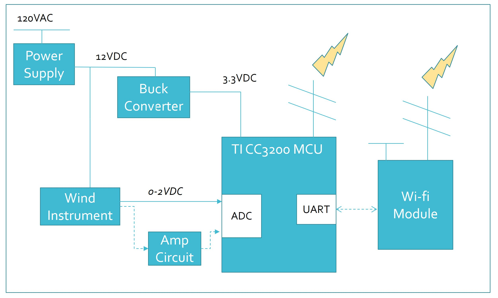
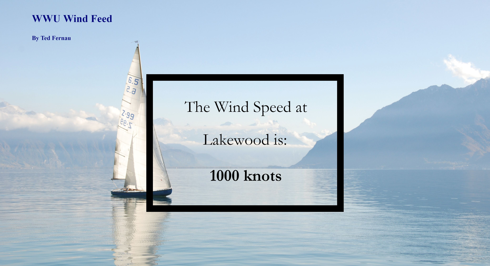

# WWU WIND FEED

WWU Wind Feed was my 2017 senior project in electrical engineering. WWU Wind Feed is a microcontroller device that serves a web page with the current wind speed at Western Washington University's Lakewood Boathouse in Bellingham WA, USA.

The project was to develop an embedded system from concept to prototype, designing and building custom hardware and firmware.

./images/demo.mp4

The demonstration video is also on [youtube](https://www.youtube.com/watch?v=sEgjqADhZPg)

## Conceptual Design

*Boathouse at WWU*

Western Washington University has a great boathouse on Lake Whatcom. Students rent sailboats, windsurf boards and various other watercraft and take classes and lessons. I learned to sail in a class at Lakewood, and later worked there teaching sailing lessons.

To have a good day of sailing you need wind. When you want to go sailing, you should check the wind conditions. A quick google search will give you decent wind data, but it is better to have localized data for the specific water you will be boating on. WWU Wind feed aims to provide this information. 

The ideal solution would provide all the data anyone needs to decide whether to visit Lakewood: wind on the water, and also temperature and weather conditions, a weather forecast, or maybe a picture, perhaps even boat or parking availability. The data would be made available as conveniently as possible to interested parties. This may be a social media post for subscribers(a great job for a Twitter bot) or a widget on the Lakewood webpage. This is a weather station and inventory system with serious web capability! Compromises were made... to provide only wind data and to serve a simple webpage.

More compromises. We sail on the middle of the lake, this is the wind we want to measure. This requires a buoy, solar panel, a battery, long range wireless communication to an internet gateway (cellular or perhaps LORA), weather proofing and permission for installing such a buoy. For achievability and cost savings, I decided the device will be at the boathouse, plugged into the wall, connected to the Lakewood WiFi.

Below I dumped documents for a technical audience to quickly evaluate this project followed by a brief conclusion. Feel free to reach out to me for more information.

*System Sketch*
*System Block Diagram*

## [Hardware](https://github.com/tedfernau/WWUWINDFEED/tree/master/hardware)

*Schematic*
*PCB Layout*
*Rendering of PCB*
*PCB Assembly - Reflow*

## [Firmware](https://github.com/tedfernau/WWUWINDFEED/tree/master/firmware)

*Dataflow Diagram*
*Webpage Design*

## [Thoughts]

This project was a great first dive into product design, mixed signal electronics design, PCB design, PCB assembly, debugging and rework, firmware development in C, and project management. The experience revealed deficits in my skills, knowledge, and personality. These revelations have been useful.

If I were going to pick this project up again, I would not make all the compromises I mentioned above. The device would run off of solar, and would not use WiFi for accessing the network. I am not sure a buoy is worth the hassle, but perhaps the device could be attached to a dock or piling and still give useful data(needs study). I would likely try to provide a picture of water conditions at least, and would look into providing the data more places on the web. 

Thank you for stopping by. Feel free to contact me, my info is on my github profile. 